# Tran Trung Nam - Kubernetes report

## Kubernetes (K8s) là gì?

- Kubernetes là một hệ thống điều phối container mã nguồn mở để tự động hóa việc triển khai, mở rộng và quản lý ứng dụng dưới dạng container.
- Kubernetes giải quyết các vấn đề liên quan tới:
  - Quản lý hàng loạt docker host
  - Lập lịch cho container
  - Rolling update
  - Scaling/Auto scaling
  - Monitor lifecycle và health check cho container
  - Self-hearing (phát hiện lỗi và tự correct lỗi)
  - Service discovery
  - Load balancing
  - Quản lý data, work node, log
  - Infrastructure as Code
  - Liên kết mở rộng với các hệ thống khác

### Kiến trúc K8s

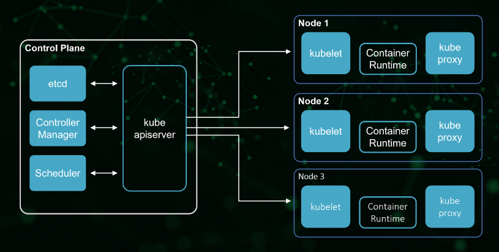

1. Control Plane
    - Là một container orchestration layer cung cấp API và giao diện để định nghĩa, triển khai, và quản lý vòng đời của các container
    - Người dùng nhập lệnh và file cấu hình từ control plane, nó sẽ kiểm soát tất cả cluster
    - Control plane quản lý các worker node và pod trong cluster
    - Trong môi trường production, control plane thường chạy trên nhiều máy và một cluster thường chạy nhiều node, cung cấp khả năng chịu lỗi và tính sẵn sàng cao
    - Các thành phần của control plane bao gồm: Kube API-Server, etcd, Kube Scheduler, Kube controller manager, Cloud controller manager

1. Node
    - Một node là một máy trong Kubernetes, có thể là máy ảo hoặc máy vật lý, tuỳ thuộc vào cluster.
    - Mỗi node được quản lí bởi control plane. Một node có thể chứa nhiều pod và control plane tự động xử lí việc lên lịch các pod thuộc các node ở trong cluster
    - Mỗi node bao gồm các thành phần: Kubelet, Kube-proxy, Container Runtime

### Các thành phần của K8s

#### Các thành phần trong Control plane

**Kube API-Server**
  - Là một thành phần trong K8s control plane cung cấp K8s API
  - Nó mở ra các HTTP API cho phép người dùng cuối cũng như các thành phần khác nhau trong chính K8s cluster có thể trao đổi thông tin với nhau.
  - API-Server cho phép người dùng lấy thông tin về trạng thái của các đối tượng trong hệ thống như Pods, Namespaces, Services...
  - Hầu hết các tác vụ sử dụng kube-api thông qua lệnh `kubectl` nhưng cũng có thể gọi trực tiếp REST API

**Scheduler**
  - Là service mặc định của K8s làm nhiệm vụ phân phối pod tới các node thích hợp.
  - Scheduler quyết định lập lịch cho các pod dựa trên các yếu tố: các yêu cầu về tài nguyên riêng và chung, các ràng buộc phần cứng/phần mềm/chính sách, đặc điểm về affinity and anti-affinity, vị trí dữ liệu, sự can thiệp tới inter-workload, và deadline.

**Controller Manager**
  - Về mặt logic, mỗi controller là một tiến trình riêng biệt nhưng để giảm sự phức tạp chúnh được biên dịch thành một tệp nhị phân đơn và chạy trong một tiến trình đơn
  - Các tiến trình này chạy liên tục để điều tiết trạng thái của hệ thống K8s, giám sát trạng thái của cluster được chia sẻ qua qua các api và thực hiện các thay đổi cần thiết để chuyển trạng của cluster tới trạng thái mong muốn
  - Một số loại controller:
      - Node controller: có trách nhiệm thông báo và phản hồi khi node bị down
      - Job controller: giám sát các đối tượng Job đại diện cho các tác vụ 1 lần, sau đó tạo pod để chạy những tác vụ đó
      - Endpoints controller: tổ chức các đối tượng Endpoints
      - Service Account & Token controllers: tạo ra các account mặc định và API access tokens cho các namespace mới

**etcd**
  - Là một cơ sở dữ liệu dạng key-value có tính khả dụng và đồng nhất cao
  - Etcd là nơi K8s lưu trữ toàn bộ các thông tin cấu hình của hệ thống

#### Các thành phần trong Node

**Container runtime**
  - Là phần mềm chịu trách nhiệm chạy các container
  - K8s hộ trợ các container runtime như `containerd`, CRI-O, và bất kỳ triển khai nào khác của K8s CRI (Container Runtime Interface)

**kubelet**
  - Một agent chạy trên mỗi node của cluster
  - Trên worker node, nhiệm vụ của nó là để worker node được đăng ký và quản lý bởi K8s cluster cũng như nhận nhiệm vụ triển khai các Pod (thường thông qua kube api-server) và đảm báo các container đó chạy ổn định.
  - kubelet không quản lý các container không được tạo bởi K8s

**kube-proxy**
  - Là một network proxy chạy trên mỗi node của cluster, triển khai một phần khái niệm K8s Service
  - kube-proxy duy trì network rules trên các node. Những network rule cho phép giao tiếp thông qua mạng tới các pod từ các phiên network trong và ngoài cluster
  - kube-proxy sử dụng lớp lọc gói tin của hệ điều hành nếu có sẵn, nếu không kube-proxy tự điều tiết traffic

## Giới thiệu kubespray

- Kubespray là công cụ mã nguồn mở hỗ trợ deploy K8s cluster tiêu chuẩn, được cộng đồng K8s khuyến khích sử dụng
- So với deploy cluster thủ công bằng `kubeadm`, bản chất Kubespray cũng tương tự nhưng các tác vụ được tự động hóa với Ansible
- Kubespray sử dụng Ansible để chạy các task như cài đặt Docker, containerd, K8s, disable swap, khởi tạo node, join/remove node, v.v... một cách tự động và chính xác đối với từng máy có vai trò khác nhau
- Hạn chế của Kubespray là chưa ổn định do tùy biến quá nhiều
- Thời gian chạy của Kubespray phụ thuộc vào cấu hình, có thể là 15-20p hoặc hơn 1 tiếng

### Deploy cluster với kubespray

- Trước tiên cần clone repo của kubespray: `git clone https://github.com/kubernetes-sigs/kubespray.git`
- Di chuyển tới thư mục `kubespray` và install dependencies: `cd kubespray && pip install -r requirements.txt`
- Có 2 phương pháp deploy với kubespray là sử dụng Ansible và Vagrant:  
    **Với Ansible**
    ```sh
    # Copy ``inventory/sample`` as ``inventory/mycluster``
    cp -rfp inventory/sample inventory/mycluster

    # Update Ansible inventory file with inventory builder
    declare -a IPS=(10.10.1.3 10.10.1.4 10.10.1.5)
    CONFIG_FILE=inventory/mycluster/hosts.yaml python3 contrib/inventory_builder/inventory.py ${IPS[@]}

    # Review and change parameters under ``inventory/mycluster/group_vars``
    cat inventory/mycluster/group_vars/all/all.yml
    cat inventory/mycluster/group_vars/k8s_cluster/k8s-cluster.yml

    # Deploy Kubespray with Ansible Playbook - run the playbook as root
    # The option `--become` is required, as for example writing SSL keys in /etc/,
    # installing packages and interacting with various systemd daemons.
    # Without --become the playbook will fail to run!
    ansible-playbook -i inventory/mycluster/hosts.yaml  --become --become-user=root cluster.yml
    ```
    **Với Vagrant**
    ```sh
    vagrant up
    ```

### Add & Remove node(s) với kubespray

**Với worker node**
- Thêm node:
    - Thêm node vào inventory `host.yaml`
    - Chạy lệnh: `ansible-playbook -i inventory/mycluster/hosts.yaml --become --become-user=root scale.yml`
    - *Lưu ý*:
        - thêm option `--limit=NODE_NAME` để giới hạn Kubespray ảnh hướng tới các node khác trong cluster
        - trước khi sử dụng `--limit`, chạy playbook `facts.yml` mà không limit để làm mới facts cache cho toàn bộ các node
- Xóa node:
    - Chạy lệnh: `ansible-playbook -i inventory/mycluster/hosts.yaml --become --become-user=root -e node=NODE_NAME remove-node.yml` với `-e node=NODE_NAME` để giới hạn phạm vi tới node cần xóa
    - Thêm `-e node=NODE_NAME -e reset_nodes=false -e allow_ungraceful_removal=true` nếu node cần xóa không online.
    - Xóa node khỏi inventory

**Với control plane node**
- Thêm node:
    - Thêm node vào file inventory và chạy với playbook `cluster.yml`, không thể dùng `scale.yml` cho control plane node
    - Với tất cả các host, restart nginx-proxy pod: `docker ps | grep k8s_nginx-proxy_nginx-proxy | awk '{print $1}' | xargs docker restart`
- Xóa node:
    - Tương tự như với worker node

Xem thêm chi tiết về scale up/scale down các node [tại đây](https://kubespray.io/#/docs/nodes)

## So sánh deploy cluster với kubeadm, kubespray

|                            | kubeadm             | kubespray                                                                                     |
|----------------------------|---------------------|-----------------------------------------------------------------------------------------------|
| Hình thức deploy           | Thủ công            | Tự động                                                                                       |
| Tích hợp công cụ           | Không               | Ansible, Vagrant, Python, pip                                                                 |
| Thời gian deploy           | Chậm hơn            | Nhanh hơn                                                                                     |
| Khả năng deploy thành công | Thấp hơn            | Cao hơn do tự động setup theo các task tiêu chuẩn và thích hợp với nhiều môi trường khác nhau |
| Khả năng tùy biến cluster  | Cao hơn do tự setup | Thấp hơn do chạy tự động                                                                      |

---

# Các khái niệm resource trên K8s

## Pod

- Pod là đơn vị nhỏ nhất mà k8s quản lý
- Pod nhóm và chạy một hoặc nhiều container với nhau trên cùng một worker node, những container trong một pod sẽ chia sẻ chung tài nguyên với nhau. Thông thường chỉ nên chạy 1 pod với 1 container
- Pod như một wrapper của container, cung cấp nhiều chức năng để quản lý và chạy một container, giúp container của ta chạy tốt hơn là chạy container trực tiếp. Ví dụ:
  - Group tài nguyên của container
  - Check container healthy và restart
  - Chắc chắn ứng dụng trong container đã chạy thì mới gửi request tới container đó
  - Cung cấp một số lifecycle để ta có thể thêm hành động vào Pod khi Pod chạy hoặc shutdown, v.v...
- Kubernetes sẽ quản lý Pod thay vì quản lý container trực tiếp

## Namespace

- Namespace là cách để ta chia tài nguyên của cluster, và nhóm tất cả những resource liên quan lại với nhau
- `kubectl get ns`: câu lệnh liệt kê các namespace trên cluster
- Một số namespace được tạo sẵn bởi k8s như `default`, `kube-system`. Mặc định khi sử dụng kubectl, sẽ là thao tác trên namespace `default`, nếu muốn làm việc với namespace khác, thì cần phải sử dụng lệnh `kubectl config set-context --current-context --namespace=NAMESPACE` hoặc thêm option `--namespace=NAMESPACE` vào lệnh `kubectl`
- Khi một namespace bị xoá thì tất cả các resource trong namespace đó sẽ bị xoá

## ReplicationControllers (RC)

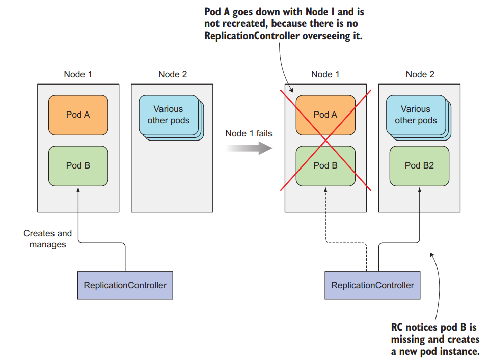

- Pod sẽ giám sát container và restart container nếu nó bị fail
- Trong trường hợp cả một node bị down, pod không thể restart được container và application bị downtime với người dùng
- RC sẽ giải quyết được vấn đề này. Nó quản lý một tập hợp các pod giống nhau thông qua label của pod và số lượng pod qua thuộc tính `replicas`
- Khi một node bị down, RC phát hiện trong số pod nó quản lý có pod bị thiếu, nó sẽ tạo ra một pod ở node khác để luôn giữ số lượng pod nó quản lý đều ở trạng thái `running` bằng số lượng pod chỉ định trong thuộc tính `replicas`
- Config Template:

```yaml
apiVersion: v1
kind: ReplicationController
metadata:
  name: hello-rc
spec:
  replicas: 2 # number of the pods RC will manage
  selector: # The pod selector determining which pods the RC is operating on
    app: hello-kube # label of pods
  template: # pod template
    metadata:
      labels:
        app: hello-kube # label of pods
    spec:
      containers:
      - image: 080196/hello-kube # image used to run container
        name: hello-kube # name of the container
        ports:
          - containerPort: 3000 # number of port to expose on the pod's IP address
```
> Sử dụng ReplicationControllers để chạy pod sẽ giúp ứng dụng của chúng ta luôn luôn availability nhất có thể. Ngoài ra ta có thể tăng performance của ứng dụng bằng cách chỉ định số lượng replicas trong RC để RC tạo ra nhiều pod chạy cùng một version của ứng dụng

> Question: Nếu trong trường hợp không có node để recreate pod thì RC sẽ xử lý như nào?
>
> Ans: ...........

### RC Thay đổi pod template

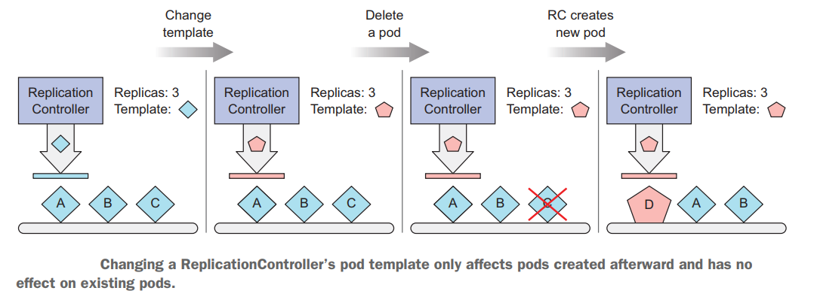

- Khi thay đổi template thì RC sẽ không đồng loạt thay đổi ngay cho các pod nó đang quản lý
- Nếu muốn thay đổi template cho toàn bộ các pod thì phải xoá hết các pod RC đang quản lý để nó recreate pod bằng 2 cách:
  - Xoá hết các pod RC đang quản lý lần lượt
  - Xoá RC và chạy lại, khi RC bị xoá thì các pod nó quản lý cũng bị xoá theo

## ReplicaSets

- Đây là một resource tương tự như RC, nhưng nó là một phiên bản mới hơn của RC và sẽ được sử dụng để thay thế RC. Chúng ta sẽ dùng ReplicaSets để deploy pod thay vì dùng RC
- Config Template:

```yaml
apiVersion: apps/v1 # change version API
kind: ReplicaSet # change resource name
metadata:
  name: hello-rs
spec:
  replicas: 2
  selector:
    matchLabels: # change here 
      app: hello-kube
  template:
    metadata:
      labels:
        app: hello-kube
    spec:
      containers:
      - image: 080196/hello-kube
        name: hello-kube
        ports:
          - containerPort: 3000
```

- ReplicaSets và RC sẽ hoạt động tương tự nhau. Nhưng ReplicaSets linh hoạt hơn ở phần label selector, trong khi label selector RC chỉ có thể chọn pod mà hoàn toàn giống với label nó chỉ định, thì ReplicaSets sẽ cho phép dùng một số expressions hoặc matching để chọn pod nó quản lý
- Ngoài ra, ta có thể dùng operators với thuộc tính `matchExpressions` như sau:

```yaml
selector:
  matchExpressions:
    - key: app
      operator: In
      values:
        - kubia
```
Có 4 operators cơ bản là: In, NotIn, Exists, DoesNotExist

## DaemonSets

- Đây là một resource tương tự như ReplicaSets, nhưng ReplicaSets có thể deploy pod ở bất cứ node nào và trong 1 node có thể chạy nhiều pod, nhưng DaemonSets chỉ chạy 1 pod trong 1 node và chắc chắn rằng có bao nhiêu node sẽ có bấy nhiêu pod, nó không có thuộc tính `replicas` trong file config

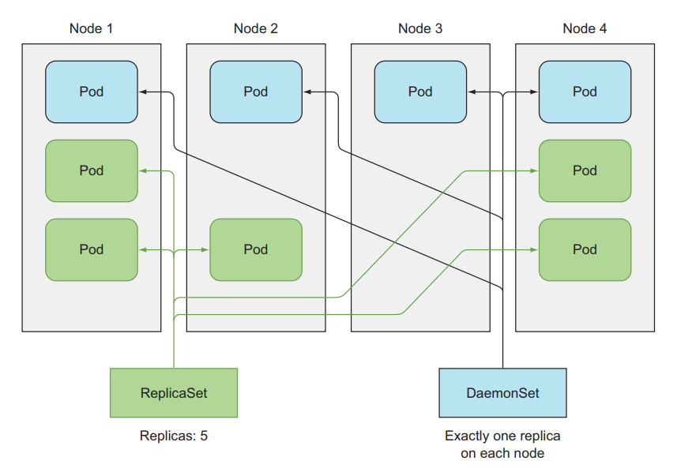

- DaemonSets được ứng dụng trong việc logging và monitoring
- Config Template:

```yaml
apiVersion: apps/v1
kind: DaemonSet
metadata:
  name: ssd-monitor
spec:
  selector:
    matchLabels:
      app: ssd-monitor
  template:
    metadata:
      labels:
        app: ssd-monitor
    spec:
      nodeSelector: # specify node to run on
        disk: ssd # label of node
      containers:
        - name: main
          image: luksa/ssd-monitor
```

> Question: Một số node đặc biệt (chẳng hạn bị taint) thì DaemonSets có deploy pod tới đó không?
>
> Ans: ...........

## Service

### Vấn đề

- Mỗi pod khi được tạo ra sẽ được đánh địa chỉ IP riêng, tuy nhiên một pod rất dễ bị xoá và thay thế bởi pod khác, điều này ảnh hưởng đến tới các client kết nối tới nó
- Thông thường một ứng dụng ta chạy trên nhiều pod để tăng performance và ta không biết được nên gửi request tới pod nào

### Giải quyết

- Service sinh ra để giải quyết vấn đề trên
- Service tạo ra một endpoint không đổi cho các pod phía sau nó, client chỉ cần tương tác với endpoint này
- Service quản lý connection tới các pod bằng cách sử dụng label selectors của pod (tương tự như RC)

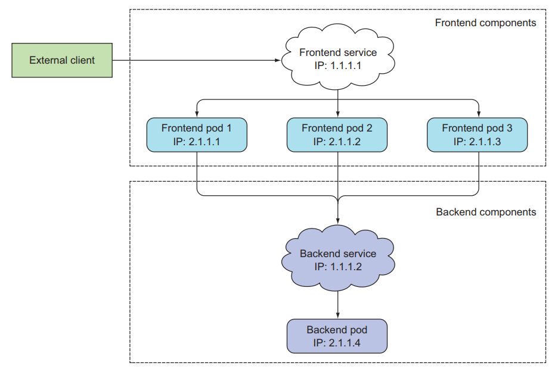

- Config Template:

```yaml
apiVersion: v1
kind: Service
metadata:
  name: hello
spec:
  selector:
    app: hello-kube # label selectors Pod
  ports:
    - port: 80 # port of the service
      targetPort: 3000 # port of the container that service will forward to 
```

> Note: Một Service có thể map bất kỳ `port` với `targetPort`. Theo mặc định và để thuận tiện, `port` và `targetPort` nên để giống nhau. (Theo trang chủ K8s)

- Có 4 loại Service cơ bản:
  - ClusterIP
  - NodePort
  - ExternalName
  - LoadBalancer

### ClusterIP

- Đây là loại service sẽ tạo một IP và local DNS mà sẽ có thể truy cập ở bên trong cluster, không thể truy cập từ bên ngoài, được dùng chủ yếu cho các Pod ở bên trong cluster dễ dàng giao tiếp với nhau
- Là loại service mặc định nếu ta không chỉ định gì trong file yaml
- Config Template:

```yaml
apiVersion: apps/v1
kind: ReplicaSet
metadata:
  name: redis
spec:
  replicas: 1
  selector:
    matchLabels:
      app: redis
  template:
    metadata:
      labels:
        app: redis
    spec:
      containers:
      - image: redis # redis image
        name: redis
        ports:
          - containerPort: 6379
---
apiVersion: v1
kind: Service
metadata:
  name: redis
spec:
  selector:
    app: redis # label selectors Pod redis
  ports:
    - port: 6379 # port of the serivce
      targetPort: 6379 # port of the container that service will forward to 
```

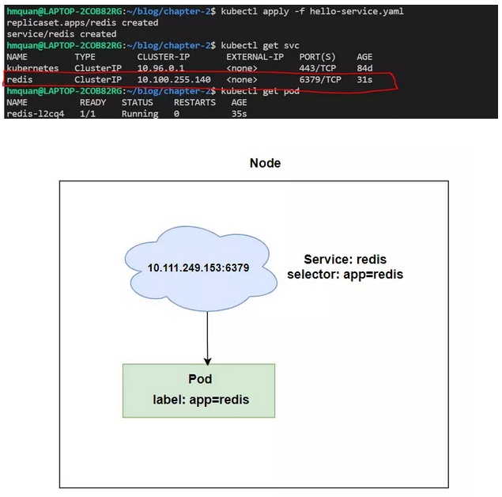

- Ví dụ demo trên tạo ra service redis có địa chỉ truy cập `redis://10.100.255.140:6379`
- Tuy nhiên với những ứng dụng đã chạy từ trước muốn truy cập tới host này, thay vì phải update thì sử dụng local DNS để truy cập
- Local DNS của service này là `redis://redis:6379`, với host name là tên của Service chúng ta đặt trong trường `metadata`


### NodePort

- Cũng tương tự ClusterIP chỉ thêm là nó sẽ sử dụng 1 port của worker node để client bên ngoài cluster có thể giao tiếp được với pod thông qua port đó
- NodePort có range mặc định từ 30000 đến 32767
- Config Template:

```yaml
apiVersion: v1
kind: Service
metadata:
  name: hello
spec:
  selector:
    app: hello-kube
  type: NodePort # type NodePort
  ports:
    - port: 80
      targetPort: 8080
      nodePort: 30123 # port of the worker node
```


- Client có thể gửi request tới Pod bằng địa chỉ **130.211.97.55:30123** hoặc **130.211.99.206:30123**

### LoadBalancer

- Khi chạy K8s trên cloud sẽ được hỗ trợ LoadBalancer Service, nếu bạn trên môi trường không có hỗ trợ LoadBalancer thì không thể tạo được loại Service này. 
- Khi tạo LoadBalancer Service, nó sẽ tạo ra cho một public IP, mà client có thể truy cập Pod bên trong Cluster bằng địa chỉ public IP này
- Config Template:

```yaml
apiVersion: v1
kind: Service
metadata:
  name: kubia-loadbalancer
spec:
  selector:
    app: kubia
  type: LoadBalancer
  ports:
    - port: 80
      targetPort: 8080
```


### Headless Service

- Với loại service ClusterIP, khi tạo service thì nó sẽ tự tạo ra một Virtual IP (VIP) cho chính nó và một DNS tương ứng với VIP đó, và VIP này sẽ mapping với pod phía sau Service

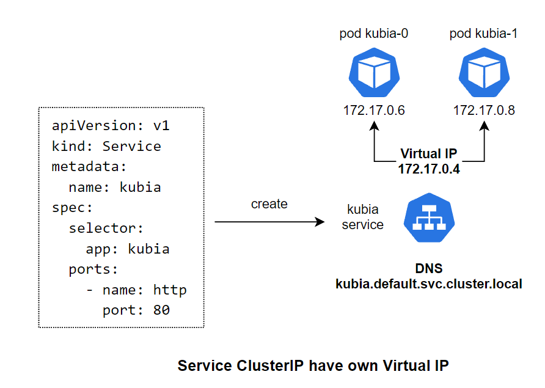

- Với loại service Headless (khai báo bằng cách chỉ định `clusterIP: None`), khi tạo service thì nó sẽ không tạo VIP mà chỉ tạo ra một DNS sau đó tạo ra DNS cho chính xác từng pod phía sau và mapping DNS tới những DNS của các pod phía sau đó

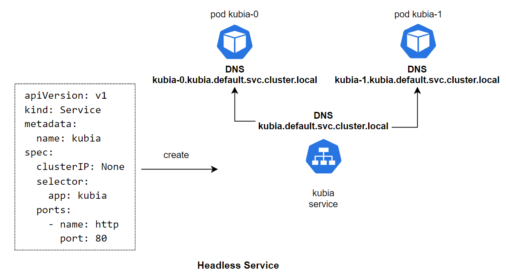

## Ingress

- Ingress là một resource cho phép chúng ta expose HTTP and HTTPS routes từ bên ngoài cluster tới service bên trong cluster của chúng ta. Ingress sẽ giúp chúng ta gán một domain thực tế với service bên trong cluster
- Config Template:

```yaml
apiVersion: extensions/v1beta1
kind: Ingress
metadata:
  name: kubia
spec:
  rules:
    - host: kubia.example.com # domain name
  http:
    paths:
      - path: /
        backend:
          serviceName: kubia-nodeport # name of the service inside cluster
          servicePort: 80
```


- Client sẽ lookup tới DNS server để nhận về IP của Ingress Controller
- Client gửi HTTP request tới Ingress Controller và chỉ định `kubia.example.com` trong trường `Host` ở header gói tin
- Với header này, Ingress Controller sẽ tìm đến Service mà client muốn access, lookup toàn bộ các pod IP thông qua đối tượng Endpoints được liên kết với Service và forward request tới một trong các pod

Xem thêm về Ingress [tại đây](https://kubernetes.io/docs/concepts/services-networking/ingress/)

## Deployment

### Vấn đề
- Một ứng dụng thường được chạy với nhiều pod
- Khi update ứng dụng cần update toàn bộ các pod đó
- Quá trình deploy này sẽ có 2 strategy (chiến lược) thông dụng là **Recreate** và **RollingUpdate**

#### Recreate


- Ở cách deploy này, đầu tiên là sẽ xóa toàn bộ phiên bản (version) cũ của ứng dụng trước, sau đó ta sẽ deploy một version mới lên. Đối với kubernes thì đầu tiên ta sẽ cập nhật Pod template của ReplicaSet, sau đó ta xóa toàn bộ Pod hiện tại, để ReplicaSet tạo ra Pod với image mới
- Ưu điểm: Đơn giản, dễ thực hiện
- Nhược điểm: Ứng dụng bị downtime tương đối lâu

#### RollingUpdate


- Ở cách này, ta sẽ deploy từng version mới của ứng dụng lên, chắc chắn rằng nó đã chạy, ta dẫn request tới version mới của ứng dụng này, lặp lại quá trình này cho tới khi toàn bộ version mới của ứng dụng được deploy và version cũ đã bị xóa. Đối với kubernetes, ta sẽ lần lượt xóa từng Pod và ReplicaSet sẽ tạo Pod mới cho ta
- Ưu điểm: Giảm downtime
- Nhược điểm: phức tạp, phải viết script để thực hiện quá trình deploy và test

### Giải quyết

- K8s cung cấp resource cho việc update ứng dụng một cách dễ dàng là Deployment
- Deployment cũng cung cấp sẵn 2 strategy để deploy là **Recreate** và **RollingUpdate**, tất cả đều được thực hiện tự động bên dưới, và các version được deploy sẽ có một histroy ở đằng sau, ta có thể rollback and rollout giữa các phiên bản bất cứ lúc nào mà không cần chạy lại CI/CD
- Khi ta tạo một Deployment, nó sẽ tạo ra một ReplicaSet bên dưới, và ReplicaSet sẽ tạo Pod. 
- Luồng hoặt động như sau: Deployment tạo và quản lý ReplicaSet -> ReplicaSet tạo và quản lý Pod -> Pod run container
- File config của Deployment đa phần giống như ReplicaSet:

```yaml
apiVersion: apps/v1
kind: Deployment 
metadata:
  name: hello-app
spec:
  replicas: 3
  strategy:
    type: RollingUpdate # strategy type is Recreate or RollingUpdate. Default is RollingUpdate
  selector:
    matchLabels:
      app: hello-app
  template:
    metadata:
      labels:
        app: hello-app
    spec:
      containers:
      - image: 080196/hello-app:v1
        name: hello-app
        ports:
          - containerPort: 3000
```

### Thao tác với Deployment

- Để update ứng dụng trong pod với Deployment: `kubectl set image deployment <deployment-name> <container-name>=<new-image>`
- Kiểm tra quá trình update: `kubectl rollout status deploy <deployment-name>`
- Luồng hoạt động của Deployment khi update:


- Khi update image, Deployment tạo ra ReplicaSet mới với template pod mới, và ReplicaSet cũ không bị xoá mà trường `replicas` sẽ được cập nhật lại là 0
- Trong trường hợp version mới bị lỗi, ta có thể rollback về version cũ một cách dễ dàng vì ReplicaSet cũ không bị xoá
- Xem lịch sử các lần update: `kubectl rollout history deploy <deployment-name>`
- Rollback về revision cũ: `kubectl rollout undo deploy <deployment-name> --to-revision=<revision-number>`
- Mặc định Deployment chỉ lưu 10 revision, có thể điều chỉnh bằng thuộc tính `revisionHistoryLimit` như sau:

```yaml
apiVersion: apps/v1
kind: Deployment 
metadata:
  name: hello-app
spec:
  revisionHistoryLimit: 1
  replicas: 3
  ...
```

Xem thêm: Deployment vs Zero downtime [tại đây](https://viblo.asia/p/kubernetes-series-bai-12-understand-pod-internal-jvElaqemlkw#_zero-downtime-deploy-voi-readiness-probe-7)

## StatefulSet

- Giống như ReplicaSet, StatefulSet là một resource giúp chúng ta chạy nhiều Pod mà cùng một template bằng cách set thuộc tính `replicas`, nhưng khác với ReplicaSet ở chỗ là Pod của StatefulSet sẽ được định danh chính xác và mỗi pod sẽ có một stable network identity riêng
- Mỗi Pod được tạo ra bởi StatefulSet sẽ được gán với một index, index này sẽ được sử dụng để định danh cho mỗi Pod. Và tên của Pod sẽ được đặt theo kiểu `<statefulset name>-<index>`, chứ không phải random như của ReplicaSet.

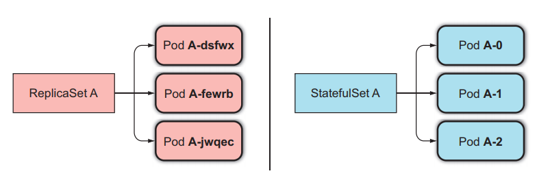

- StatefulSet thay thế pod bị mất:

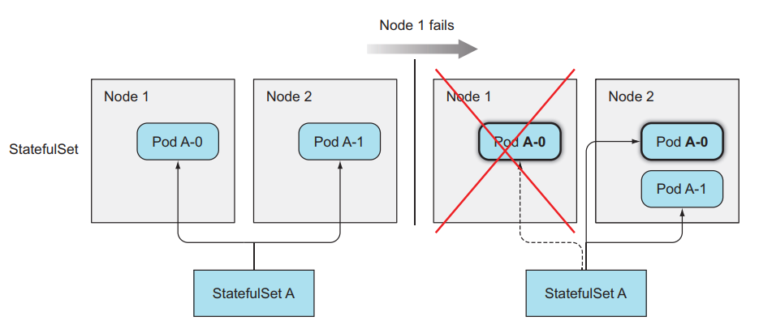

- ReplicaSet thay thế pod bị mất:

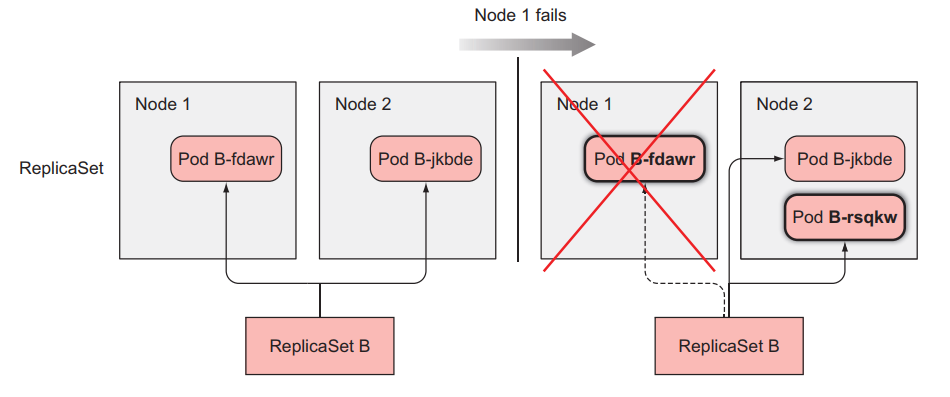

- StatefulSet scale pod:
  - Scale up: ví dụ StatefulSets đang có replicas bằng 2, sẽ có 2 Pod là `<pod-name>-0`,`<pod-name>-1`, khi ta scale up Pod lên bằng 3, Pod mới được tạo ra sẽ có tên là `<pod-name>-2`
  - Scale down: nó sẽ xoá pod với index lớn nhất
  - Đối với StatefulSets thì khi ta scale up và scale down thì ta có thể biết chính xác tên của Pod sẽ được tạo ra hoặc xóa đi

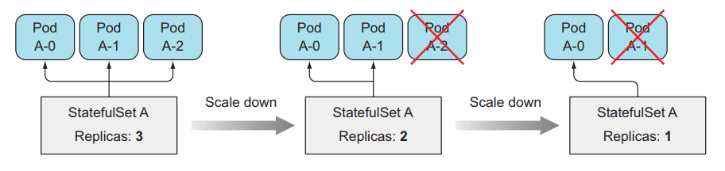

- StatefulSet cung cấp storage riêng cho mỗi pod bằng cách tạo ra PersistentVolumeClaims cho mỗi Pod và gắn nó vào cho từng Pod tương ứng

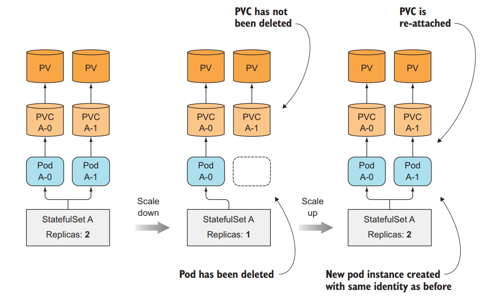

### Tạo StatefulSet:

```yaml
apiVersion: v1
kind: Service
metadata:
  name: kubia
spec:
  clusterIP: None
  selector:
    app: kubia
  ports:
    - name: http
      port: 80
---
apiVersion: apps/v1beta1
kind: StatefulSet
metadata:
  name: kubia
spec:
  serviceName: kubia # the name of service
  replicas: 2
  template: # pod template
    metadata:
      labels:
        app: kubia
    spec:
      containers:
        - name: kubia
          image: luksa/kubia-pet
          ports:
            - name: http
              containerPort: 8080
      volumeMounts:
        - name: data
          mountPath: /var/data
  volumeClaimTemplates: # pvc template
    - metadata:
        name: data
      spec:
        resources:
          requests:
            storage: 1Mi
        accessModes:
          - ReadWriteOnce
```

- Khác với ReplicaSet, StatefulSet cần khai báo thêm template cho PersistentVolumeClaims và dùng nó để tạo ra PVC riêng cho từng pod

- Ở đây sử dụng Headless Service bằng cách chỉ định `ClusterIP: None` để định danh địa chỉ cho từng Pod

### StatefulSet thay thế pod khi node bị down

- Không giống như ReplicaSet, StatefulSet sẽ đảm bảo việc không bao giờ tạo Pod mà có định danh giống nhau, nên khi một node down, StatefulSet sẽ không tạo ra Pod mới trước khi chắc chắn rằng Pod cũ không còn nữa
- Khi một node bị down, Pod trên node sẽ có status là `Unknown`. Sau một thời gian node không sống lại thì pod trên node được tháo ra và chuyển status về `Terminating`
- Với ReplicaSet, vì các Pod nó quản lý có định danh ngẫy nhiên, không trùng nhau nên khi một Pod có status là `Terminating` thì nó sẽ tạo ra một Pod mới và khi tạo xong bất kể Pod cũ có bị Terminate chưa thì nó cũng bị xoá khỏi cluster
- Với StatefulSet do pod có định danh cố định, pod mới tạo ra có tên giống pod cũ nên một khi pod nằm trên node bị down và có status là `Terminating` thì nó vẫn sẽ không tạo ra một pod mới cho đến khi chắc chắn rằng pod cũ đã bị xoá hoàn toàn. Nhưng vì node đã bị down không thế báo lại cho master rằng pod đó đã bị xoá thành công hay chưa nên pod luôn luôn ở trạng thái `Terminating`, ta cần phải xoá pod bằng tay để StatefulSet tạo ra pod mới.

## Volume

- Một số loại volume được sử dụng trong K8s:
  - emptyDir
  - hostPath
  - gitRepo
  - nfs
  - gcePersistentDisk, awsElasticBlockStore, azureDisk (cloud storage)
  - cinder, cephfs, iscsi, flocker, glusterfs, quobyte, rbd, flexVolume, vsphereVolume, photonPersistentDisk, scaleIO
  - configMap, secret, downwardAPI
  - PersistentVolumeClaim
- Những loại volume trên được phân làm 3 nhóm chính:
  - Volume dùng để chia sẻ dữ liệu giữa các container trong Pod
  - Volume đính kèm vào trong filesystem một node
  - Volume đính kèm vào cluster và các node khác nhau có thể truy cập

### emptyDir

- Là loại đơn giản nhất
- Nó tạo ra một empty directory trong pod. Các container trong pod có thể ghi dữ liệu vào nó
- Volume chỉ tồn tại trong một lifecycle của Pod, dữ liệu trong loại volume này chỉ được lưu trữ tạm thời và sẽ mất đi khi Pod bị xóa. 
- Ta dùng loại volume này khi ta chỉ muốn các container có thể chia sẻ dữ liệu lẫn nhau và không cần lưu trữ dữ liệu lại. Ví dụ là dữ liệu log từ một container chạy web API, và ta có một container khác sẽ truy cập vào log đó để xử lý log
- Config Template:

```yaml
apiVersion: v1
kind: Pod
metadata:
  name: fortune
spec:
  containers:
    - name: html-generator
      image: luksa/fortune # this image will gen random content and save to /var/htdocs/index.html file each 10s
      volumeMounts:
        - name: html # The volume called html is mounted at /var/htdocs in the container
          mountPath: /var/htdocs
    - name: web-server
      image: nginx:alpine
      ports:
        - containerPort: 80
          protocol: TCP
      volumeMounts:
        - name: html # The volume called html is mounted at /usr/share/nginx/html in the container
          mountPath: /usr/share/nginx/html
          readOnly: true
  volumes: # define volumes
    - name: html # name of the volumes
      emptyDir: {} # define type is emptyDir
```

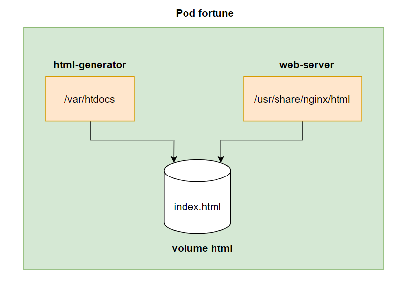

### gitRepo

- Nó cũng sẽ tạo ra một empty directory trong pod như emptyDir, sau đó clone code của git repo vào directory này


```yaml
apiVersion: v1
kind: Pod
metadata:
  name: gitrepo-volume-pod
spec:
  containers:
    - image: nginx:alpine
      name: web-server
      volumeMounts:
        - name: html
          mountPath: /usr/share/nginx/html
          readOnly: true
      ports:
        - containerPort: 80
          protocol: TCP
  volumes:
    - name: html
      gitRepo: # gitRepo volume
        repository: https://github.com/luksa/kubia-website-example.git # The volume will clone this Git repository
        revision: master # master branch
        directory: . # cloned into the root dir of the volume.
```

> Volume này hiện chỉ hỗ trợ public repo, với private repo thì phải sử dụng một pattern gọi là **sidecar containers**

### hostPath


- Loại volume này sẽ mount point từ pod ra ngoài filesystem của node
- Dùng để lưu trữ persistent data
- Dữ liệu chỉ tồn tại trên một worker node và không bị xoá đi khi pod bị xoá
- Config Template:

```yaml
apiVersion: v1
kind: Pod
metadata:
  name: hostpath-volume
spec:
  containers:
    - image: nginx:alpine
      name: web-server
      volumeMounts:
        - name: html
          mountPath: /usr/share/nginx/html
          readOnly: true
        - name: log # log volume
          mountPath: /var/log/nginx # mounted at /var/log/nginx in the container
      ports:
        - containerPort: 80
          protocol: TCP
  volumes:
    - name: html
      gitRepo: # gitRepo volume
        repository: https://github.com/luksa/kubia-website-example.git # The volume will clone this Git repository
        revision: master # master branch
        directory: . # cloned into the root dir of the volume.
    - name: log
      hostPath: # hostPath volume
        path: /var/log # folder of woker node
```


- Đối với loại volume này thì Pod của ta cần phải được tạo đúng worker node thì ta mới có được dữ liệu trước đó, nếu Pod của ta được tạo ở một worker node khác thì khi đó Pod sẽ không có dữ liệu cũ, do dữ liệu vẫn nằm ở worker node cũ. Loại volume này ta không sử dụng nó cho việc lưu trữ persistent data hoàn toàn được.

### PersistentVolumeClaim (PVC) vs PersistentVolume (PV)

- Loại volume này giúp tách Pod ra khỏi storage technology bên dưới
- Để sử dụng loại volume này, k8s cung cấp 2 resource là **PersistentVolumeClaims** và **PersistentVolumes**
- Với PersistentVolumes là resource sẽ tương tác với kiến trúc storage bên dưới, và PersistentVolumeClaims sẽ request storage từ PersistentVolumes
- PV & PVC Config Template:

```yaml
apiVersion: v1
kind: PersistentVolume
metadata:
  name: mongodb-pv
spec:
  capacity:
    storage: 10Gi # size of the storage
  accessModes: # access mode
    - ReadWriteOnce # can be mounted by a single worker node for reading and writing
    - ReadOnlyMany # can be mounted by a multiple worker node for reading only
  persistentVolumeReclaimPolicy: Retain
  gcePersistentDisk:
    pdName: mongodb
    fsType: ext4
---
apiVersion: v1
kind: PersistentVolumeClaim
metadata:
  name: mongodb-pvc
spec:
  resources:
    requests:
      storage: 10Gi # request 10Gi storage
  accessModes:
    - ReadWriteOnce # only allow one node can be read and write
  storageClassName: "" # prevent from using storage class to create PV automatically
```

- Thuộc tính `persistentVolumeReclaimPolicy` có 3 mode:
  - Retain: Khi delete PVC thì PV vẫn tồn tại nhưng ở trạng thái Release vì đã được PVC sử dụng và đang chứa dữ liệu, điều này để cho PVC khác không bound vào, tránh gây lỗi
  - Recycle: Khi delete PVC thì PV vẫn tồn tại nhưng dữ liệu trong PV bị xoá, trạng thái chuyển về Available để PVC khác có thể bound vào
  - Delete: Khi delete PVC thì PV bị xoá theo


Tạo pod sử dụng PVC:

```yaml
apiVersion: v1
kind: Pod
metadata:
  name: mongodb
spec:
  containers:
    - image: mongo
      name: mongodb
      volumeMounts:
        - name: mongodb-data
          mountPath: /data/db
      ports:
        - containerPort: 27017
          protocol: TCP
  volumes:
    - name: mongodb-data
      persistentVolumeClaim:
        claimName: mongodb-pvc # specify PVCs we want to use
```


#### Lợi ích
- Đối với k8s developer
  - Không cần quan tâm kiến trúc storage bên dưới node
  - Không cần quan tâm dữ liệu được lưu ở worker node hay cloud storage
  - File config của PVC có thể tái sử dụng ở nhưng cluster khác mà không cần biết cluster đó hỗ trợ những kiến trúc storage nào

#### Hạn chế
- Đối với k8s administrator:
  - Config phức tạp hơn các loại volume khác

Xem thêm: Dynamic provisioning PV (Tự động cấp PV) [tại đây](https://viblo.asia/p/kubernetes-series-bai-7-persistentvolumeclaims-tach-pod-ra-khoi-kien-truc-storage-ben-duoi-6J3Zgyeq5mB#_tu-dong-cap-persistentvolumes-dynamic-provisioning-7)

### ConfigMap

- Thông thường một ứng dụng cần sử dụng một số giá trị config
- Ta có thể cung cấp nó vào pod thông qua biến môi trường `env` với file config như sau:

```yaml
apiVersion: v1
kind: Pod
metadata:
  name: hello-env
spec:
  containers:
    - image: 080196/hello-env
      name: hello-env
      ports:
        - containerPort: 3000
      env: # pass env to container
        - name: PORT # env name
          value: "3000" # env value
```

- Khi container đã chạy, danh sách biến env này không thể update, muốn update thì cần phải xoá pod để chạy lại
- Một điều nữa khi viết biến env như này không thể tái sử dụng và làm cồng kềnh file config
- K8s cung cấp resource tách configuration ra file riêng gọi là ConfigMap

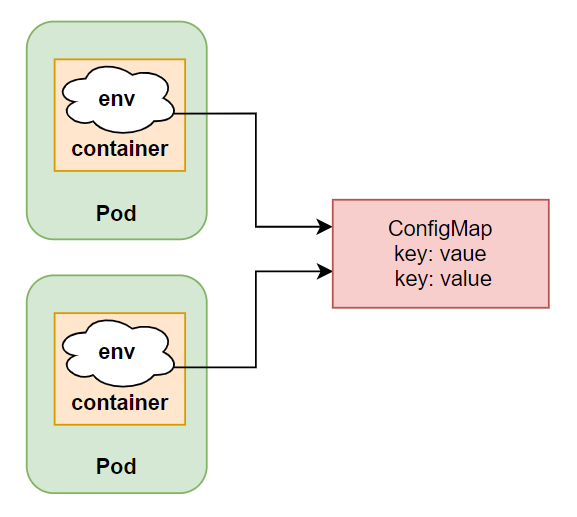

- ConfigMap có thể được tạo từ CLI hoặc YAML file:
  - CLI:

  ```sh
  $ kubectl create cm postgres-config --from-literal=DB=postgres --from-literal=USER=postgres --from-literal=PASSWORD=postgres
  configmap/postgres-config created
  ```

  - YAML file:

  ```yaml
  apiVersion: v1
  kind: ConfigMap
  metadata:
    name: postgres-config
  data:
    DB: postgres
    USER: postgres
    PASSWORD: postgres
  ```

#### Sử dụng ConfigMap

```yaml
apiVersion: v1
kind: Pod
metadata:
  name: hello-cm
  labels:
    app: application
spec:
  containers:
    - image: 080196/hello-cm
      name: hello-cm
      ports:
        - containerPort: 3000
      envFrom: # using envFrom instead of env
        - configMapRef: # referencing the ConfigMap
            name: postgres-config # name of the ConfigMap
          prefix: POSTGRES_ # All environment variables will be prefixed with POSTGRES_
      env:
        - name: PORT
          value: "3000"
        - name: DB_HOST
          value: postgres
...
```

#### ConfigMap dạng file:
```yaml
apiVersion: v1
kind: ConfigMap
metadata:
  name: nginx-config
data:
  my-nginx-config.conf: |
    server {
      listen 80;
      server_name www.kubia-example.com;

      gzip on;
      gzip_types text/plain application/xml;

      location / {
        root /usr/share/nginx/html;
        index index.html index.htm;
      }
    }

---
apiVersion: v1
kind: Pod
metadata:
  name: nginx
spec:
  containers:
    - image: nginx:alpine
      name: web-server
      volumeMounts:
        - mountPath: /etc/nginx/conf.d # mount content of the configmap to container
          name: config
          readOnly: true
  volumes:
    - name: config # volume use configmap as content
      configMap:
        name: nginx-config # configmap name
```
- Sử dụng ConfigMap dạng file, ở đây ConfigMap sẽ được sử dụng như một volume
- Ta có thể thay đổi tên, chỉ mount content, chỉ định quyền cho file. [Xem thêm tại đây](https://viblo.asia/p/kubernetes-series-bai-8-configmap-and-secret-truyen-cau-hinh-vao-container-RQqKL6rrl7z#_dung-configmap-de-truyen-cau-hinh-dang-file-vao-trong-container-thong-qua-volume-config-4)

### Secret

- Tương tự như ConfigMap nhưng để lưu thông tin nhạy cảm
- ConfigMap có thể được truy cập và đọc bởi developer nhưng Secret phải có quyền mà administrator cho phép mới đọc được
- K8s tăng security hơn bằng cách: 
  - Chỉ gửi secret tới worker node mà có pod cần dùng
  - Dữ liệu secret được lưu trong memory mà không bao giờ lưu ở physical storage tại worker node, khi worker node down thì secret sẽ bị xoá đi, còn ở master node secret được lưu trong etcd dưới dạng encrypted
- Secret có thể được tạo từ CLI hoặc YAML file nhưng nên dùng CLI hơn:

```sh
$ kubectl create secret generic postgres-config --from-literal=DB=postgres --from-literal=USER=postgres --from-literal=PASSWORD=postgres
secret/postgres-config created
```

- Edit secret: `kubectl edit secrets <secret-name>`

```yaml
apiVersion: v1
data: # base64 encode.
  DB: cG9zdGdyZXM=
  PASSWORD: cG9zdGdyZXM=
  USER: cG9zdGdyZXM=
kind: Secret
metadata:
  creationTimestamp: "2021-09-24T10:40:26Z"
  name: postgres-config
  namespace: default
  resourceVersion: "1027803"
  uid: 9c7ed846-2ca4-4c58-946a-26cdccce2b1f
type: Opaque
```

- Dữ liệu được mã hoá base64, trước khi thay đổi thì ta cũng cần phải mã hoá dữ liệu mới và paste vào đây 
- Khi Pod sử dụng, dữ liệu sẽ được decode trở lại
- Lệnh đơn giản trên Linux: `echo  'password' | base64`

#### Sử dụng secret:

```yaml
apiVersion: v1
kind: Pod
metadata:
  name: hello-cm
  labels:
    app: application
spec:
  containers:
    - image: 080196/hello-cm
      name: hello-cm
      ports:
        - containerPort: 3000
      envFrom: # using envFrom instead of env
        - secretRef: # use secretRef instead of env configMapRef
            name: postgres-config # name of the Secret
          prefix: POSTGRES_
      env:
        - name: PORT
          value: "3000"
        - name: DB_HOST
          value: postgres
...
```

> Sử dụng ConfigMap cho thông tin không nhạy cảm, khai báo dưới dạng plain configuration (YAML file)
>
> Sử dụng Secret cho thông tin nhạy cảm, khai báo dưới dạng CLI

## Giới thiệu Ambassador containers pattern

- K8s API Server cung cấp các thông tin về toàn bộ cluster, ta có thể truy cập tới thông qua REST API
- Tuy nhiên trước khi truy cập tới API Server, ta cần phải authentication
- Từ container muốn truy cập tới API Server để lấy dữ liệu cần phải sử dụng 3 file: `namepsace`, `token` và `ca.crt`

```sh
$ TOKEN=$(cat token)
$ curl --cacert ca.crt -H "Authorization: Bearer $TOKEN" https://kubernetes
{
  "paths": [
    "/.well-known/openid-configuration",
    "/api",
    "/api/v1",
    "/apis",
    "/apis/",
    ...
  ]
}
```

- Hình minh hoạ:


- Thay vì phải làm nhiều thao tác khi mỗi lần cần truy cập tới API Server như trên, ta có ambassador pattern để hỗ trợ việc authentication
- Pattern này sẽ deploy một sidecar container cùng pod với main container
- Main container chỉ cần gọi tới sidecar container và nó sẽ gửi request của main container tới API Server
- Hình minh hoạ:

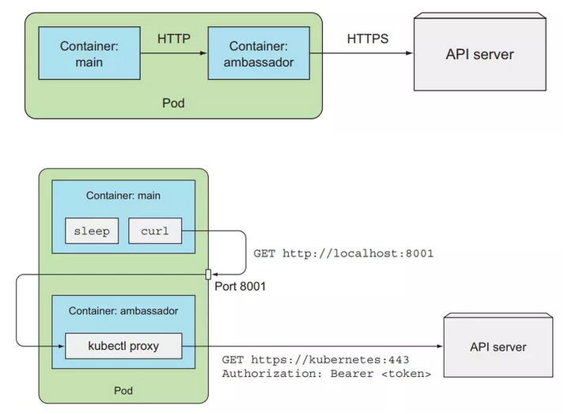

## Security

### ServiceAccount & Role Based Access Control (RBAC)

- Với API Server có 2 loại client được phân biệt rõ ràng:
  - Humans (users)
  - Pod (ứng dụng chạy bên trong container)
- Đối với user, thường sử dụng `kubectl` hoặc thực hiện một HTTP request với token để authentication tới API server. 
- Đối với Pod, thì sẽ sử dụng ServiceAccount để authentication tới API server

#### Groups

- K8 sử dụng group để cấp quyền tới một nhóm user hoặc ServiceAccount thay vì phải cấp quyền cho từng đối tượng riêng lẻ
- Group được phân tách ra bằng authentication plugin cùng với thông tin như username và user id, có 4 group mặc định là:
  - `system:unauthenticated` - được gán cho user không authenticated thành công.
  - `system:authenticated` - được gán cho user authenticated thành công.
  - `system:serviceaccounts` - group cho toàn bộ ServiceAccounts.
  - `system:serviceaccounts:<namespace>` - group cho toàn bộ ServiceAccounts trong một namespace.

#### ServiceAccount (SA)

- SA được mount tự động vào bên trong container của Pod ở folder `/var/run/secrets/kubernetes.io/serviceaccount` khi Pod được tạo ra
- Folder này gồm 3 file: `token`, `ca.crt` và `namespace`
- File token chứa thông tin về Pod client. Khi thực hiện request tới server, API Server sẽ tách thông tin từ token ra
- SA username được tách ra có dạng: `system:serviceaccount:<namespace>:<service account name>`, trong đó `system:serviceaccount:<namespace>` là group và `<service account name>` là tên của SA được sử dụng
- SA là một namespace resource, ta không thể sử dụng bởi namespace khác và mối namespace có một SA là default được tự động tạo khi namespace được tạo
- Một SA có thể được sử dụng bởi nhiều Pod khác nhau trong cùng một namespace


#### Sử dụng SA để tối giản việc sử dụng Secret mỗi khi pull image từ private registry

- Khi tạo Pod mặc định SA default được gán cho Pod
- Thông tin về SA default như sau:

```sh
$ kubectl describe sa default
Name:                default
Namespace:           default
Labels:              <none>
Annotations:         <none>
Image pull secrets:  <none>
Mountable secrets:   default-token-tnbgw
Tokens:              default-token-tnbgw
Events:              <none>
```

- Ta sẽ thực hiện thêm secret để auth với private registry vào cho SA default

```sh
$ kubectl create secret docker-registry my-secret --docker-server=registry.kala.ai --docker-username=username --docker-password=12345678 # create registry secret
$ kubectl patch sa default --type json -p '[{"op":"replace","path":"/imagePullSecrets[0].name", "value": "my-secret"}]' # add secret to SA default
```

- Như vậy tất cả Pod có thể pull được image từ private registry mà ta không cần khai báo `imagePullSecrets` khi viết config cho Pod

#### Tạo SA

- Sử dụng lệnh: `kubectl create sa <sa-name>`
- Khi một SA được tạo ra, một Secret chứa 3 file mà sẽ được mount vào bên trong container của Pod ở folder `/var/run/secrets/kubernetes.io/serviceaccount` cũng được tạo ra và Secret này được mount và trường `Mountable secrets` của SA (decsribe SA để xem chi tiết)

#### Sử dụng SA trong Pod

- Mặc định Pod sẽ được sử dụng SA default nếu không chỉ định gì trong file config
- Muốn sử dụng SA khác ta thêm trường `spec.serviceAccountName`:

```yaml
apiVersion: apps/v1
kind: Deployment
...
    spec:
      serviceAccountName: bar # add sa name here
      containers:
        - name: background-consume-queue
          image: registry.kala.ai/web-crm/background-consume-queue
...
```

> Question: Pod có thể dùng nhiều SA không?
>
> Ans: ...........

#### RBAC

- Kể từ version 1.8.0, RBAC sẽ được enable mặc định, và ta có thể tạo Role và gán với từng SA nhất định. 
- Chỉ cho phép một SA thực hiện những hành động mà ta cho phép, theo **Principle of Least Privilege**

#### Action

- Các action ta có thể thực hiện tới API server và verb tương ứng khi ta dùng để định nghĩa role được cho dưới bảng sau:

  |   Action  |  Verb  |
  |-----------|--------|
  | HEAD, GET | get    |
  | POST      | create |
  | PUT       | update |
  | PATCH     | patch  |
  | DELETE    | delete |

- RBAC có các resource sau:
  - Roles: định nghĩa verb nào có thể được thực hiện lên trên namespace resouce
  - ClusterRoles: định nghĩa verb nào có thể được thực hiện lên trên cluster resouce
  - RoleBindings: gán Roles tới một SA
  - ClusterRoleBindings: gán ClusterRoles tới SA
- Roles là namespace resource nên nó sẽ thuộc về 1 namespace nào đó, còn ClusterRoles không thuộc về 1 namespace nào cả


#### Tạo Role và RoleBinding

```yaml
apiVersion: rbac.authorization.k8s.io/v1
kind: Role
  metadata:
  namespace: foo
  name: service-reader
rules:
  - apiGroups: [""]
    verbs: ["get", "list"]
    resources: ["services"]
---
apiVersion: rbac.authorization.k8s.io/v1
kind: RoleBinding
metadata:
  name: test
  namespace: foo
roleRef:
  apiGroup: rbac.authorization.k8s.io
  kind: Role # this must be Role or ClusterRole
  name: service-reader # this must match the name of the Role or ClusterRole you wish to bind to
subjects:
  - kind: ServiceAccount # Kind is User or ServiceAccount
    name: default # name of the SA
    namespace: foo
```


- Ta cũng có thể sử dụng RoleBinding cho SA ở namespace khác bằng cách thêm vào trường `subjects` trong file config

```yaml
...
subjects:
...
- kind: ServiceAccount
  name: default
  namespace: bar
```


#### Tạo ClusterRole và ClusterRoleBinding

```yaml
apiVersion: rbac.authorization.k8s.io/v1
kind: ClusterRole
  metadata:
  name: pv-reader
rules:
  - apiGroups: [""]
    verbs: ["get", "list"]
    resources: ["persistentvolumes"]
---
apiVersion: rbac.authorization.k8s.io/v1
kind: ClusterRoleBinding
metadata:
  name: pv-test
roleRef:
  apiGroup: rbac.authorization.k8s.io
  kind: ClusterRole
  name: pv-reader
subjects:
  - kind: ServiceAccount # Kind is User or ServiceAccount
    name: default # name of the SA
    namespace: foo
```


- K8s có một số ClusterRole và ClusterRoleBinding mặc định như:

```sh
$ kubectl get clusterroles # list all clusterroles
NAME
admin
cluster-admin
edit
...
system:discovery
...
view
...
$ kubectl get clusterrolebindings # list all clusterrolebindings
admin
cluster-admin
edit
...
system:discovery
...
view
...
```

- Xem thêm chi tiết [tại đây](https://viblo.asia/p/kubernetes-series-bai-13-serviceaccount-and-role-based-access-control-security-kubernetes-api-server-07LKXQD4ZV4#_clusterrole-va-clusterrolebinding-mac-dinh-12)

# Helm
## Helm là gì?
- Helm là một open source package manager của Kubernetes được viết bởi ngôn ngữ lập trình Go
- Helm cung cấp khả năng cung cấp, chia sẻ và sử dụng phần mềm được xây dựng cho Kubernetes
- Helm được tạo ra vào năm 2015 tại Deis, sau đó được Microsoft mua lại

## 3 khái niệm lớn của Helm
- `Chart`: là một Helm package. Nó bao gồm toàn bộ định nghĩa các resource cần thiết để chạy ứng dụng, tool, hay service bên trong K8s cluste
- `Repository`: là nơi có thể lấy hay chia sẻ charts
- `Release`: là một instance của một chart đang chạy trong K8s cluster. Một chart thường có thể được install nhiều lần trong cùng cluster. Mối lần install, một release được tạo ra
> Từ 3 khái niệm trên có thể giải thích Helm một cách ngắn gọn là: Helm install *charts* vào K8s, tạo một *release* mới cho mỗi lần install và để tìm kiếm *chart* mới, ta có thể tìm kiếm trên *repository*

## Helm có thể làm gì?
- Tạo chart mới từ đầu
- Đóng gói các chart thành các chart archive files (tgz)
- Tương tác với chart repository nơi lưu trữ các chart
- Install và uninstall các chart vào K8s cluster
- Quản lý chu kỳ release của chart mà được install với Helm

## Các thành phần của Helm
- Bao gồm 2 thành phần là **Helm Client** và **Helm Library**

### Helm Client (CLI)
- Helm Client là một command-line client cho người dùng cuối. Helm client có trách nhiệm:
  - Phát triển local chart
  - Quản lý repository
  - Quản lý các release
  - Tương tác với Helm library:
    - Gửi chart để install vào K8s cluster
    - Yêu cầu upgrade hoặc uninstall release

### Helm Library
- Helm library cung cấp logic để thực thi tất cả những hoạt động Helm
- Nó tương tác với K8s API Server và cung cấp những khả năng như:
  - Kết hợp một chart và configuration để build một release
  - Install các chart vào K8s
  - Upgrade và uninstall các chart bằng cách tương tác với K8s

## Một số lệnh cơ bản của Helm

### `helm list`: List các release
- `helm list`: List toàn bộ các release ở trạng thái deployed
- `helm list <flag>`: List các release theo flag, như `--all`, `----uninstalled`

### `helm search`: Tìm kiếm chart
- `helm search hub <keyword>`: Tìm kiếm trong [Artifact Hub](https://artifacthub.io/) các chart với keyword tương ứng
- `helm search repo <repo-name>`: Tìm kiếm các chart trong repo mà đã được add vào local helm client bằng lệnh `helm repo add`

### `helm install`: Install chart vào K8s cluster
- `helm install <release-name> <chart-name>`: Install chart vào K8s cluster với release-name. Nếu muốn Helm tự động sinh ra release name thì sử dụng `helm install <chart-name> --generate-name`

### `helm status`
- `helm status <release-name>`: Xem trạng thái của các release đang chạy

### `helm upgrade` & `helm rollback`: Upgrade release và recover khi bị fail
- `helm upgrade -f <file-name> <release-name> <chart-name>`: Upgrade release với file YAML mình tạo
- `helm rollback <release-name> <revision-number>`: Rollback release về revision chỉ định. Thông tin về revision có thể được tìm thông qua lệnh `helm history <release-name>`. Xem thêm [`helm history`](https://helm.sh/docs/helm/helm_history/)

### `helm uninstall`
- `helm uninstall <release-name>`: Uninstall release với tên chỉ định

## Customize chart trước Install
- Thông thường một chart khi có thể được install ngay, khi đó nó sẽ sử dụng các default configuration values
- Khi chạy thực tế ta không sử dụng default configuration values của nhà cung cấp mà ta cần customize và override chúng cho project của mình
- Các bước thực hiện:
  - Kiểm tra configuration values mặc định bằng lệnh: `helm show values <chart-name>`
  - Tạo file chưa configuration values của mình theo định dạng YAML và trùng với tên biến họ định nghĩa để ghi đè chúng
  - Install với file values mới của mình: `helm install -f <file-name> <chart-name> --generate-name`
  > Helm chỉ ghi đè những value được định nghĩa trong file mình tạo ra, những value khác không bị ghi đè thì vẫn lấy mặc định

### Các cách install chart
- `helm install <release-name> <chart-name>`: install chart từ repository
- `helm install <release-name> <tgz file>`: install từ local chart archive
- `helm install <release-name> apth/to/chart`: install chart từ directory (chart chưa đóng gói)
- `helm install <release-name> <url>`: install chart từ url, vd: `https://example.com/charts/foo-1.2.3.tgz`

## Tạo một chart

- Sử dụng lệnh: `helm create <chart-name>` để tạo ra chart mới. Chart tạo ra các cấu trúc sau:

- Chỉnh sửa các giá trị, v.v... để định nghĩa cho chart của mình
- `helm package <chart-name>`: để đóng gói chart của mình
- install char của mình vào k8s bằng tgz file vừa đóng gói hoặc trực tiếp thông qua directory

=============  
Kiến thức bổ sung:
- Quá trình API Server authentication & authorization: [Link](https://viblo.asia/p/kubernetes-series-bai-11-kubernetes-internals-architecture-L4x5xPjb5BM#_api-server-6)
- ClusterRole và ClusterRoleBinding mặc định, vai trò và chức năng của một số đối tượng đó: [Link](https://viblo.asia/p/kubernetes-series-bai-13-serviceaccount-and-role-based-access-control-security-kubernetes-api-server-07LKXQD4ZV4#_clusterrole-va-clusterrolebinding-mac-dinh-12)


- Bài 10 - Downward API: truy cập Pod metadata: [Link](https://viblo.asia/p/kubernetes-series-bai-10-downward-api-truy-cap-pod-metadata-m68Z0eGdlkG)
- Bài 12 - Tìm hiểu sâu về pod và Zero downtime: [Link](https://viblo.asia/p/kubernetes-series-bai-12-understand-pod-internal-jvElaqemlkw)
- Bài 14 - PodSecurityPolicies - NetworkPolicy: security cho cluster nodes và network: [Link](https://viblo.asia/p/kubernetes-series-bai-14-podsecuritypolicies-networkpolicy-security-cho-cluster-nodes-va-network-djeZ1d1gKWz)
- Bài 15 - Quản lý và tính toán tài nguyên sử dụng cho Pod: [Link](https://viblo.asia/p/kubernetes-series-bai-15-quan-ly-va-tinh-toan-tai-nguyen-su-dung-cho-pod-GrLZDB9n5k0)
- Bài 16 - Automatic scaling Pod và cluster: [Link](https://viblo.asia/p/kubernetes-series-bai-16-automatic-scaling-pod-va-cluster-YWOZrGyRlQ0)
- Bài 17 - Advanced scheduling: Taints and tolerations: [Link](https://viblo.asia/p/kubernetes-series-bai-17-advanced-scheduling-taints-and-tolerations-924lJBDalPM)
- Bài 18 - Advanced scheduling: node affinity and pod affinity: [Link](https://viblo.asia/p/kubernetes-series-bai-18-advanced-scheduling-node-affinity-and-pod-affinity-gAm5y7jqZdb)
- Bài 19 - Adding custom resource to Kubernetes: [Link](https://viblo.asia/p/kubernetes-series-bai-19-adding-custom-resource-to-kubernetes-end-eW65GB8alDO)
